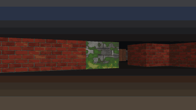
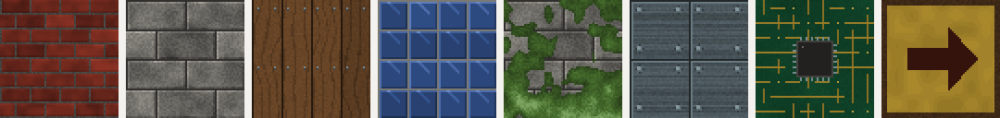
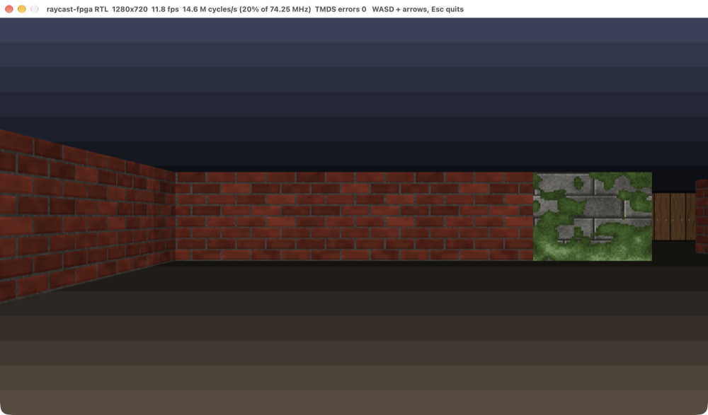

# raycast-fpga

**A Wolfenstein-3D-style raycaster in SystemVerilog that renders 1280x720 at
60 Hz over HDMI without a framebuffer, verified bit for bit against a golden
model.**

It targets the Real Digital Urbana board (Spartan-7 XC7S50), the board used
by MIT 6.205 (Digital Systems Laboratory). Raycasters are a classic 6.205
final project; this is a learning reimplementation of that idea, not a new
one. What it tries to do well is the engineering around it: a written
specification as an executable model, unit and system tests that compare
every bit, a memory architecture that fits the real chip, a cycle budget that
is measured rather than guessed, and synthesis numbers. It has **not** been
run on a physical board.

[繁體中文說明](README.zh-TW.md) · [Design](docs/DESIGN.md) · [Project report (6.205 format)](docs/report.md) · [初學者導讀](docs/導讀.zh-TW.md)



*Every frame above is the Verilator simulation's HDMI (TMDS) output decoded
back into pixels; nothing is drawn by software. Full-resolution frame:
[docs/media/frame.png](docs/media/frame.png).*

## What is in it

* **Ray engine** (`rtl/ray_engine.sv`): one ray per screen column, DDA grid
  walk, perpendicular distance (no fisheye), a shared radix-2 divider for the
  four divisions per column, texture coordinates, side and distance shading.
  All fixed point, formats documented in [DESIGN.md](docs/DESIGN.md#4-fixed-point-formats).
* **No framebuffer**: the engine writes 70 bits per column into a
  double-buffered table (2 x 1280 entries, 6.5% of the chip's block RAM); a
  five-stage pixel pipeline regenerates every pixel from that table plus the
  texture ROM while the beam scans.
* **HDMI**: CEA-861 720p timing generator, TMDS encoder per DVI 1.0 with DC
  balancing, OSERDESE2 10:1 serialisers and an MMCM for the board.
* **Player**: forward/back/strafe/turn from debounced buttons, collision with
  wall sliding.
* **Assets**: the map is a text file (`maps/level1.txt`); eight 64x64
  textures are generated procedurally by `tools/gen_assets.py` (no game
  assets). The arrow sign is asymmetric on purpose, so a mirrored wall face
  would be obvious.

  
* **Golden model** (`model/raycast_model.py`): integer Python that computes
  the same values as the hardware, in the same widths, with the same rounding.
* **Tests**: model property tests, cocotb unit tests on Icarus for every
  module, Verilator full-system tests at 320x180 and 1280x720, lint with
  `verilator -Wall`, Yosys synthesis for the XC7S50, CI on GitHub Actions.
* **Interactive demo**: the RTL in a window, driven by the keyboard.

## Quick start

Needs Verilator 5 (tested with 5.052), Icarus Verilog (tested with 13.0),
Yosys (synthesis tested with 0.69 and 0.33), Python 3.10+ and a C++17
compiler; SDL2 for the window and ffmpeg for videos (macOS:
`brew install verilator icarus-verilog yosys sdl2 ffmpeg`).

```sh
make venv        # once: .venv with cocotb and pytest (requirements-dev.txt)
make test        # lint + model + unit (cocotb/Icarus) + system (Verilator), ~90 s
make play        # open the 720p RTL simulation in a window (WASD/arrows, Esc)
make play-small  # same RTL built at 320x180, scaled up, much smoother
make synth       # Yosys synth_xilinx for the XC7S50 -> synth/report.md
make video       # scripted walk -> build/media/walk.mp4 and .gif
make bench       # simulation speed
```

On macOS you can also double-click **`玩玩看.command`** ("try it"): it checks
the tools, builds the simulator and opens the game window.

Controls: `W`/`Up` forward, `S`/`Down` back, `Left`/`Right` (or `Q`/`E`) turn,
`A`/`D` strafe. To change the level, edit `maps/level1.txt`, run
`make assets`, and rebuild.



## Results

All numbers below were measured on an Apple M5 (10 cores, shared with other
work at the time) with Verilator 5.052, Icarus Verilog 13.0, Yosys 0.69 and
cocotb 2.1.

### Verification

`make test` output (abridged):

```
lint: verilator -Wall clean
18 passed in 64.20s        # tests/model (7) + tests/unit (11 cocotb builds, 30 test cases)
6 passed in 19.30s         # tests/system (Verilator)
```

| Layer | What is compared | Volume |
|---|---|---|
| Model tests | worst-case DDA length, budget inequalities, player never inside a wall, ROM images reproducible, map parsing | 7 tests |
| TMDS encoder | every reachable disparity state x every byte, vs. a reference written from the DVI spec | 2,304 cases + 60,000 random cycles |
| Ray engine (unit) | every column bit-exact vs. the model, plus the engine's cycle counter vs. a cycle model, on the real map and random maps | 328 frames at 3 resolutions |
| Pixel pipeline (unit) | every pixel vs. the model, sync alignment every cycle | 11 frames |
| Full system | player state, all 1280 (or 320) column entries and whole frames rebuilt from decoded TMDS, vs. the model | 347,840 column entries, 285 frames, 0 mismatches |

Edge cases are tested on purpose: views at exactly 0/90/180/270 degrees (a
ray component of exactly zero), rays along grid lines and through grid
vertices, standing exactly on a wall face (distance 0, saturated height) and
one LSB away from it. Random tests use a fixed seed (`TEST_SEED`, default
6205) that every failure message prints. Three real bugs were found during
development, two by the tests and one by review (then pinned down with a test
that fails on the old code); they are listed in [the report](docs/report.md#43-bugs-the-tests-found).

### Synthesis (Yosys `synth_xilinx`, XC7S50)

| Resource | Used | Available | Share |
|---|---:|---:|---:|
| LUT | 2,293 | 32,600 | 7.0% |
| Flip-flops | 1,207 | 65,200 | 1.9% |
| Block RAM (36 Kb) | 13 | 75 | 17.3% |
| DSP48E1 | 19 | 120 | 15.8% |

Per-block numbers: [synth/report.md](synth/report.md). Yosys maps to
7-series primitives but does not place, route or time the design; **no
open-source flow gives timing sign-off for this part, so there is no Fmax
claim here.**

### Cycle budget

A 720p frame is 1,237,500 cycles of the 74.25 MHz pixel clock. The engine
spends exactly `141 + 2 x (DDA steps)` cycles per column, a formula the tests
check against its own cycle counter on every frame. The longest possible walk
in a closed 32x32 map is 59 steps, so the worst possible frame takes 331,520
cycles (26.8%); the worst frame seen in the tests took 215,098 (17.4%). No
frame was ever dropped.

### Simulation speed (`make bench`)

| Build | Frames/s | Simulated clock | Share of real time |
|---|---:|---:|---:|
| 1280x720 | 11.9 | 14.7 MHz | 19.9% |
| 320x180 | 156 | 14.3 MHz | n/a (not a real video mode) |

## How it works


1. Once per frame, `frame_ctrl` lets the player move (turn, then x, then y,
   each checked against the map), then starts the ray engine.
2. For each of the 1280 columns the engine computes the ray direction, walks
   the grid cell by cell until it hits a wall, and derives the wall's height
   on screen and the texture column. It writes one 70-bit entry into the back
   half of the column table.
3. Meanwhile the pixel pipeline scans the front half: for pixel `(x, y)` it
   reads entry `x`, decides wall or ceiling or floor, computes the texture row,
   reads the texel and its palette colour, shades it, and passes it to the
   TMDS encoders.
4. When the visible part of the frame ends, the halves swap.

The design reasoning (why no framebuffer, why one clock, the fixed-point
formats and their overflow argument, the fisheye correction, the alternatives
rejected) is in [docs/DESIGN.md](docs/DESIGN.md).

## Limitations

* **Not run on hardware.** There is no bitstream: the open-source toolchain
  stops at synthesis here, and Vivado was not used. The pin file
  `synth/urbana.xdc` is copied from Real Digital's published Urbana
  constraints (with two typos in that file corrected), but has not been
  through Vivado.
* No timing analysis (see above).
* The interactive demo runs at about 12 frames per second at 720p because it
  simulates every clock cycle of the hardware; the `play-small` build is
  smoother.
* One fixed 32x32 map compiled in at build time; no floor or ceiling
  textures, sprites, doors or minimap.
* Board controls are limited to the Urbana's four buttons and switches
  (btn[0] reset, btn[1] forward or back with sw[0], btn[2]/btn[3] turn or
  strafe with sw[1]).

## Related work

Raycasters are a popular FPGA project; this repository does not claim a new
idea. Projects it was compared with:

* **MazeCaster** (T. Hagenlocker, C. Hu, H. Hussein, MIT 6.205, Fall 2024):
  raycasting on the same Urbana board with parallel DDA units, 8.8 fixed
  point and two 8-bit frame buffers at one fourth of 720p's dimensions; its
  report says the design used all 2.7 Mbit of the board's block RAM. This project's main
  difference is the per-column table instead of frame buffers, which allows
  full 720p with 24-bit colour in 17% of the block RAM, plus the bit-exact
  model-based test suite.
* The 6.205 [final project archive](https://fpga.mit.edu/6205/F25/final_project_archive)
  lists other rendering projects, for example "Voxel Ray Tracer" (2024),
  "Poor Man's VR: Raymarching with Stereoscopic Offset and Gyroscopic
  Control" (2023), "FPGA Fractal Ray Marcher" and "REND3R" (2022) and "FPGA
  Ray Tracer" (2019).
* [dormando/verilog-raycaster](https://github.com/dormando/verilog-raycaster):
  a Verilog raycaster driving a 320x240 SPI LCD, casting the next ray while
  the previous line is drawn.
* [mayawarrier/raycast-3D-CycloneFPGA](https://github.com/mayawarrier/raycast-3D-CycloneFPGA):
  a Wolfenstein-style raycaster for Cyclone V FPGAs, drawing 160 slices per
  frame.
* [dataflowg/fpga-raycaster](https://github.com/dataflowg/fpga-raycaster):
  a raycaster written in LabVIEW FPGA with a parallel column renderer.
* Columbia University CSEE 4840 (Spring 2022) "Lightspeed" project: FPGA
  raycasting in the same tradition.
* The algorithm itself follows Lode Vandevenne's
  [raycasting tutorial](https://lodev.org/cgtutor/raycasting.html) (DDA with
  `deltaDist = 1/|ray|` and perpendicular distance), adapted to fixed point
  and to a map whose rows grow downwards.

Module interfaces such as `video_sig_gen` and `tmds_encoder` follow 6.205 lab
conventions; the code in this repository is my own.

## Repository layout

```
maps/level1.txt          the level (edit me, then `make assets`)
tools/gen_assets.py      map -> ROM images, procedural textures, palette, sin/cos table
model/raycast_model.py   bit-exact golden model (the specification)
rtl/                     portable SystemVerilog (simulated and tested)
rtl/board/               Urbana wrapper: MMCM, OSERDESE2, OBUFDS (synthesis only)
rtl/mem/                 generated ROM images loaded with $readmemh
sim/sim_main.cpp         Verilator harness: TMDS-decoding sink, play/record/bench/run modes
tests/model              model and asset tests
tests/unit               cocotb unit tests (Icarus)
tests/system             Verilator full-system tests
synth/                   Yosys script, resource report, Urbana pin constraints
docs/                    design notes, project report, beginner guide, diagram, media
玩玩看.command            double-click launcher for macOS
```

## License

MIT, see [LICENSE](LICENSE).
