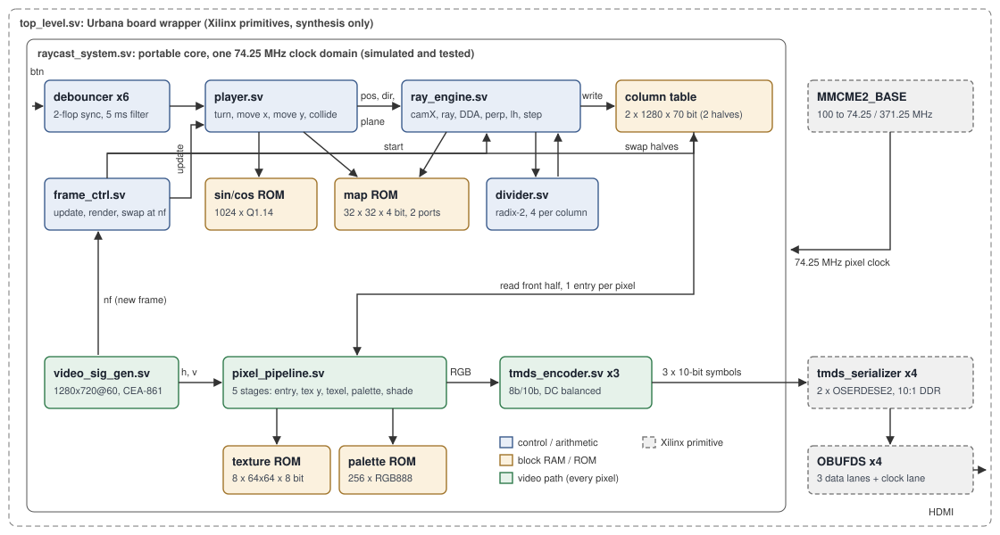

# raycast-fpga: A Hardware Raycaster for 720p HDMI on a Spartan-7

Final project report, written in the format of an MIT 6.205 (Digital Systems
Laboratory) final report. Independent learning project by useless-husband;
not affiliated with MIT.

## Abstract

raycast-fpga renders a first-person view of a textured 32x32 maze, in the
style of Wolfenstein 3D, entirely in SystemVerilog hardware and sends it out
as 1280x720 at 60 Hz over HDMI. A ray engine casts one ray per screen column
with a fixed-point DDA grid walk and writes a 70-bit description of each
column into a double-buffered table; a five-stage pixel pipeline regenerates
every pixel on the fly from that table and a texture ROM, so no framebuffer is
needed and the whole design uses 17% of the XC7S50's block RAM. A bit-exact
Python golden model specifies every intermediate value. Unit tests (cocotb on
Icarus) and full-system tests (Verilator, with the HDMI output decoded back
into frames) compare the hardware with the model bit for bit: 347,840 column
entries and 285 complete frames, with zero mismatches. The design synthesises
with Yosys to 2,293 LUTs, 1,207 flip-flops, 13 block RAMs and 19 DSP slices.
It has not been run on a physical board.

## 1. Introduction

Raycasting turns a 2D grid map into a 3D-looking image by casting one ray per
screen column and drawing a vertical wall slice whose height is inversely
proportional to the distance the ray travelled. It is a natural FPGA project:
the work is regular, the arithmetic is small, and the output is a video
signal, which forces the design to meet hard real-time deadlines (a pixel
every 13.5 ns at 720p). It is also a well-trodden 6.205 final project (see
Related Work in the README); this implementation is a learning
reimplementation that concentrates on the engineering process: a written
specification in the form of a golden model, layered verification, a memory
architecture that fits the real part, and a measured cycle budget.

Goals:

1. Full 1280x720 at 60 Hz, 24-bit colour, on the Urbana board's Spartan-7.
2. Textured walls with procedurally generated textures, side shading and
   distance shading, fisheye-free.
3. A map loaded from an editable text file.
4. A player that walks, strafes, turns and slides along walls.
5. Every hardware output provably equal to a reference model.

## 2. System overview

The design has two loops running in the same 74.25 MHz clock domain:

* **Per frame**: `frame_ctrl` tells the player FSM to apply the buttons once,
  then starts the ray engine, which fills the back half of the column table
  (1280 entries) in about 0.2M of the frame's 1.24M cycles.
* **Per pixel**: the video timing generator walks the 1650 x 750 raster; for
  each visible pixel the pixel pipeline reads that column's entry from the
  front half, decides wall/ceiling/floor, fetches the texel and its palette
  colour, shades it, and hands it to three TMDS encoders.

At the end of each visible frame (`nf`) the halves swap if the engine is done.
The board wrapper adds the MMCM (100 MHz to 74.25 and 371.25 MHz), four
OSERDESE2 pairs for 10:1 serialisation, and the differential output buffers.

## 3. Modules

Widths are given for the 720p build; most are parameters.

### 3.1 video_sig_gen

| Port | Dir | Width | Meaning |
|---|---|---|---|
| pixel_clk_in, rst_in | in | 1 | clock, synchronous reset |
| hcount_out / vcount_out | out | 11 / 10 | raster position, 0..1649 / 0..749 |
| hs_out, vs_out | out | 1 | sync pulses, active high (CEA-861 720p) |
| ad_out | out | 1 | current position is visible |
| nf_out | out | 1 | one-cycle pulse at (1280, 720), the first cycle after the last visible pixel |
| fc_out | out | 6 | frame counter mod 60 |

Two counters with registered flags. All outputs describe the same cycle. In
reset the counters park on the last blanking pixel, so the first cycle after
reset is pixel (0, 0) of a complete frame.

### 3.2 tmds_encoder

| Port | Dir | Width | Meaning |
|---|---|---|---|
| data_in | in | 8 | colour byte |
| control_in | in | 2 | {C1, C0}; {vsync, hsync} on the blue lane |
| ve_in | in | 1 | data enable |
| tmds_out | out | 10 | symbol, one cycle later |

DVI 1.0 section 3.3.3: XOR/XNOR transition minimisation into 9 bits, then
conditional inversion to keep the running disparity bounded. Disparity is a
5-bit signed counter; reachable values are the even numbers -8..+8.

### 3.3 divider

| Port | Dir | Width | Meaning |
|---|---|---|---|
| dividend_in, divisor_in | in | 32 | operands, sampled with data_valid_in |
| quotient_out, remainder_out | out | 32 | floor division results |
| data_valid_out | out | 1 | result pulse, 33 cycles after the request |
| error_out | out | 1 | divisor was 0 (quotient all ones) |
| busy_out | out | 1 | division in progress; new requests are ignored |

Radix-2 restoring division, one bit per cycle.

### 3.4 debouncer

Two-flop synchroniser followed by a counter: the output takes a new value only
after the input has held it for `STABLE_CYCLES` consecutive cycles (371,250 =
5 ms on the board, 64 in the small simulation build).

### 3.5 player

| Port | Dir | Width | Meaning |
|---|---|---|---|
| update_in | in | 1 | apply one frame of movement |
| btn_in | in | 6 | {strafe_r, strafe_l, right, left, back, fwd}, debounced |
| load_in, load_x/y_in, load_angle_in | in | 1, 19, 10 | teleport instead of moving (test port) |
| map_addr_out / map_data_in | out / in | 10 / 4 | map ROM port B |
| pos_x/y_out | out | 19 | position, Q5.14 |
| angle_out | out | 10 | heading, 1024 per turn |
| dir_x/y_out, plane_x/y_out | out | 16 | Q1.14 view vectors |
| done_out | out | 1 | update finished (8 cycles) |

Turn, read cos/sin from its own dual-port ROM, compute the displacement, probe
the map for x, then for y (wall sliding), then compute the camera plane
`0.66 * (-sin, cos)`.

### 3.6 ray_engine

| Port | Dir | Width | Meaning |
|---|---|---|---|
| start_in | in | 1 | latch the view and render a frame |
| pos_x/y_in, dir_*, plane_* | in | 19, 16 | view from the player |
| map_addr_out / map_data_in | out / in | 10 / 4 | map ROM port A |
| col_we_out, col_x_out, col_data_out | out | 1, 11, 70 | column-table write |
| busy_out, done_out | out | 1 | status |
| cycles_out | out | 24 | length of the last frame (performance counter) |

A 16-state FSM: camera X, ray direction, two reciprocal divisions, initial
side distances, DDA (2 cycles per grid step: step, then map lookup),
perpendicular distance, line-height division, texture-step division, write.
The column entry is
`{draw_start[10], draw_end[10], tex_id[3], tex_x[6], shade[3], lh_half[15], step[23]}`.
Details and the fixed-point formats are in [DESIGN.md](DESIGN.md#4-fixed-point-formats).

### 3.7 frame_ctrl

| Port | Dir | Width | Meaning |
|---|---|---|---|
| nf_in, player_done_in, engine_done_in | in | 1 | events |
| update_out, engine_start_out | out | 1 | commands |
| front_out | out | 1 | which half of the column table is displayed |
| valid_out | out | 1 | a complete table has been shown at least once (black before) |
| swap_out | out | 1 | pulse at each swap |
| drops_out | out | 16 | frames shown twice because the engine was late |

### 3.8 Column table (ram_sdp)

Simple dual-port RAM, 2560 x 70 bit: entries 0..1279 are one half, 1280..2559
the other. Write port from the ray engine (always the back half), registered
read port for the pixel pipeline (always the front half). Maps to five
RAMB36E1.

### 3.9 pixel_pipeline

| Port | Dir | Width | Meaning |
|---|---|---|---|
| hcount_in, vcount_in, ad_in, hs_in, vs_in | in | 11, 10, 1 | from video_sig_gen |
| front_in, valid_in | in | 1 | from frame_ctrl |
| table_addr_out / table_data_in | out / in | 12 / 70 | column-table read port |
| rgb_out, de_out, hs_out, vs_out | out | 24, 1 | pixel and syncs, 5 cycles later |

Stages: table entry; wall test and texture-row product; texture ROM
(8 x 64 x 64 x 8-bit palette indices); palette ROM (256 x RGB888); shading and
selection. Ceiling and floor are flat colours with an 8-step gradient towards
the horizon.

### 3.10 Board wrapper (top_level, tmds_serializer)

`MMCME2_BASE` with VCO = 100 x 37.125 / 5 = 742.5 MHz, divided by 10 (pixel
clock) and 2 (serial clock). Reset is held until the MMCM locks and released
synchronously. Each TMDS lane uses an OSERDESE2 master/slave pair in 10:1 DDR
mode; the clock lane serialises `0000011111`. Buttons: btn[0] reset, btn[1]
forward (backward with sw[0]), btn[2]/btn[3] turn (strafe with sw[1]). Pins
come from Real Digital's published Urbana constraints file
(`synth/urbana.xdc`).

## 4. Verification

### 4.1 Strategy

The golden model `model/raycast_model.py` (about 350 lines of integer Python)
is the specification. Each hardware value has a model counterpart computed
with the same widths, the same floor-rounding shifts, the same saturation and
the same tie-breaks, so tests can demand exact equality rather than a
tolerance. Model and RTL read the same ROM images, which a deterministic
generator produces from the map text file and procedural texture code.

Three layers:

1. **Model tests** (pytest, no simulator): properties the design relies on.
2. **Unit tests** (cocotb 2.1 on Icarus Verilog), one module at a time, each
   against the model or an independent reference.
3. **System tests** (Verilator): the whole `raycast_system`. The harness acts
   as an HDMI sink: it decodes the three TMDS lanes, rebuilds frames only from
   decoded symbols, and checks every clock that the symbol stream matches the
   pixels and syncs that entered the encoders. Python then checks player
   states, column tables, frames and the engine's cycle counter against the
   model.

Randomised tests use fixed seeds (`TEST_SEED`, default 6205), printed in every
failure message.

### 4.2 Results

All of the following pass with `make test` (lint, then the model and unit
tests, then the system tests), which takes about 90 seconds on an Apple M5.

**Model tests** (6): column-word pack/unpack round trip (2,000 random words);
worst-case DDA length of 59 steps reached and never exceeded, and the budget
inequalities; the player never enters a wall over 20,000 random button
presses; axis-aligned views give an exactly zero ray component; the generator
reproduces the committed ROM images byte for byte; maps with an open border
are rejected.

**Unit tests** (cocotb, 11 builds, 30 test cases):

| Module | What is checked |
|---|---|
| video_sig_gen | every output on every cycle for 3 frames at a small resolution; every sync/active edge position over one complete 1650 x 750 frame |
| tmds_encoder | all 9 reachable disparity states x 256 bytes = 2,304 cases; the 4 control tokens; 60,000 random cycles with blanking, decoded back, with the wire's DC balance measured independently of the reference (never beyond +-8) |
| divider | 13 edge cases including 2^28/1 and max/max, exact 33-cycle latency, divide by zero, requests while busy, 3,000 random operand pairs of every magnitude |
| debouncer | exact delay of a clean press, rejection of bursts shorter than the window, 20,000 random cycles against a cycle model |
| player | scripted walk with wall slide (x stops within one step of the probe limit while y keeps moving), teleports at 8 angles, 1,500 random updates on the real map, 12 random maps x 150 updates |
| ray_engine | 64x48: 72 edge-case frames (axis angles at cell centres, on grid lines and vertices, on and one LSB from wall faces), a zero-distance frame, 60 random frames on the real map, 60 random maps of 0-45% density; 77x45 (odd sizes): edge cases and random maps; 1280x720: 3 frames. Every column bit-exact, and every frame's cycle count equal to the cycle model |
| pixel_pipeline | 6 frames from golden column tables in both table halves (18,432 pixels), 4 frames of random column words, black output before the first valid table, and sync/data-enable alignment on every cycle |
| frame_ctrl | lockstep reference model while the engine's finish time is swept over 91 values across the frame boundary, plus 20,000 cycles of random latencies; liveness (every finished table is shown within one frame) |

**System tests** (Verilator, 6):

| Scenario | Resolution | Views | Column entries compared | Whole frames compared |
|---|---|---:|---:|---:|
| edge cases | 320x180 | 22 | 7,040 | 22 |
| random teleports | 320x180 | 150 | 48,000 | 150 |
| scripted walk with collisions | 320x180 | 318 | 101,760 | 37 |
| random buttons | 320x180 | 301 | 96,320 | 63 |
| start view, edge cases, random | 1280x720 | 12 | 15,360 | 12 |
| random views (tables) | 1280x720 | 62 | 79,360 | 1 |
| **Total** | | **865** | **347,840** | **285** |

In those runs about 167 million clock cycles of TMDS output (three lanes) were
decoded and cross-checked with zero errors, the worst on-wire running
disparity was 8, and no frame was dropped. `verilator --lint-only -Wall` is
clean for the portable design and for the board top (against behavioural
stand-ins of the four Xilinx primitives).

### 4.3 Bugs the tests found

1. **Sign extension in the hit-point multiply** (ray engine unit test, first
   run). A ray component declared `logic [17:0]` instead of `logic signed`
   was zero-extended inside a 28-bit product, misaligning textures on faces
   seen through a negative ray component. Found by edge case 5.
2. **Off-by-one after reset** (video timing test). The first post-reset frame
   started at pixel (1, 0). Fixed by parking the counters on the last blanking
   pixel during reset.
3. **Lost done pulse in the frame controller** (design review, then a test).
   An `engine_done` in the same cycle as `nf` was ignored and the controller
   waited forever. Fixed and covered by the latency sweep, which fails on the
   old logic.

The tests themselves had bugs too (a latency off by one in the pixel test, a
TMDS checker armed in the middle of a data period); each disagreement was
traced to one side before changing anything.

## 5. Resource usage

Yosys 0.69 `synth_xilinx -family xc7`, full board top (`make synth`,
[synth/report.md](../synth/report.md)):

| Resource | Used | XC7S50 | Share |
|---|---:|---:|---:|
| LUT | 2,293 | 32,600 | 7.0% |
| Flip-flop | 1,207 | 65,200 | 1.9% |
| Block RAM (36 Kb) | 13 | 75 | 17.3% |
| DSP48E1 | 19 | 120 | 15.8% |

The ray engine is the largest block (938 LUTs, 651 flip-flops, 9 DSPs),
followed by the player (390 LUTs) and the pixel pipeline (294 LUTs, 8 DSPs,
7.5 block RAMs of texture). The 1024 x 4-bit map ROM is built from LUTs
(143). For comparison, the MazeCaster 6.205 project reports 2,271 LUTs and 21
DSPs with all 2.7 Mbit of block RAM used (frame buffers at a reduced
resolution, FIFOs, textures and maps).

There is no timing result. Yosys maps to 7-series cells but does not place,
route or analyse timing, and the open-source 7-series place-and-route flows do
not provide timing sign-off. Every multiply in the ray engine has its own FSM
state and every pixel-pipeline multiply is followed by a register, which is
what a Vivado run would most likely need at 74.25 MHz, but that is a design
intention, not a measurement.

## 6. Cycle budget

At 720p a frame is 1650 x 750 = 1,237,500 cycles of the 74.25 MHz clock. The
ray engine's cost per column is exactly `141 + 2 * steps` cycles (four
34-cycle divisions, the DDA at two cycles per step, and seven single-cycle
states). Both test layers check this formula against the engine's own
counter for every frame.

| | Cycles | Share of frame |
|---|---:|---:|
| player update | 8 | <0.001% |
| worst column (59 DDA steps) | 259 | |
| worst possible frame (1280 x 259) | 331,520 | 26.8% |
| worst frame seen in the tests | 215,098 | 17.4% |
| typical frame during the scripted walk | ~198,000 | ~16% |

The worst case needs 3.7x less time than is available, so there is room for
roughly two more full passes per frame (floor casting, sprites), or for the
same engine at a lower clock.

## 7. Challenges and lessons learned

* **Deciding the memory architecture first.** The arithmetic in section 1 of
  DESIGN.md (a 720p framebuffer is 8x the chip's block RAM) settled the design
  before any RTL was written: per-column table, pixels recomputed every frame.
* **Writing the model as the specification, not as a check.** Every rounding
  choice had to be made once and written down in Python. After that, a
  mismatch is never "close enough": either the model or the RTL is wrong, and
  the test output says which column and which intermediate value.
* **Saturation needs a proof, not a guess.** Clamping a reciprocal looked
  harmless until the arithmetic showed it changes which grid line a ray
  crosses. The final widths come with an overflow argument in DESIGN.md.
* **Coordinates and handedness.** With map rows growing downwards, the camera
  plane is `(-sin, cos)` and the texture-mirroring rule differs from the most
  common tutorial. An asymmetric arrow texture makes a mirrored face obvious.
* **Testing the test bench.** The TMDS checker and a pipeline-latency check
  were wrong before the hardware was; checking which side disagreed with the
  specification before editing either one saved time.
* **Tooling around a path with spaces.** Verilator's generated makefiles
  refuse directories with spaces, so the Verilated model is compiled with one
  direct compiler command; every script uses relative paths.

## 8. Future work

* Bring-up on a real Urbana board with Vivado: timing closure at 74.25 MHz,
  TMDS output to a monitor, and comparing captured frames with the model.
* Floor and ceiling casting (a texture lookup per floor pixel; the budget
  allows it).
* Sprites with a per-column depth buffer (the column table already holds the
  wall height, which is the inverse of its distance).
* Doors, a minimap overlay, more maps selected by switches.
* Moving the map and textures to DDR3 for larger worlds.

## References

1. L. Vandevenne, "Raycasting", Lode's Computer Graphics Tutorial,
   https://lodev.org/cgtutor/raycasting.html (the DDA and
   perpendicular-distance formulation followed here).
2. Digital Display Working Group, *Digital Visual Interface (DVI) Revision
   1.0*, 1999, section 3.3 (TMDS encoding).
3. CEA-861, timing for 1280x720p at 60 Hz (VIC 4).
4. MIT 6.205 Digital Systems Laboratory I, https://fpga.mit.edu/6205/ (lab
   conventions for module interfaces such as `video_sig_gen` and
   `tmds_encoder`).
5. T. Hagenlocker, C. Hu, H. Hussein, "MazeCaster: Pseudo 3D World using
   Raycasting", MIT 6.205 final report, Fall 2024.
6. Real Digital, Urbana board documentation and constraints file,
   https://www.realdigital.org/hardware/urbana.
7. AMD/Xilinx UG471 (SelectIO, OSERDESE2) and UG472 (clocking, MMCM).
